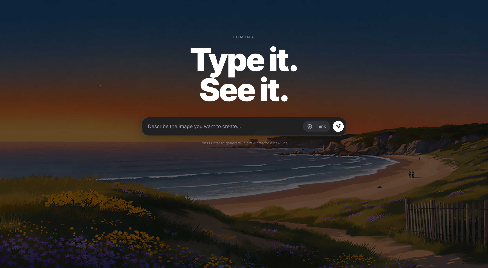

# Lumina



Text-to-image generation with a prompt-enhancement stage in front of it. You type a short
idea; a language model rewrites it into a full image prompt; an image model renders it.
Both stages stream to the browser over Server-Sent Events, so the UI shows what is
happening rather than a spinner.

Two deployables in one repository:

| Path      | What it is                          | Deployed as                    |
| --------- | ----------------------------------- | ------------------------------ |
| `/`       | Vite + React 19 single-page app     | Vercel static site             |
| `/server` | Express 5 API, TypeScript           | Vercel function (`server.ts`)  |

The frontend never talks to a model provider directly. `vercel.json` rewrites `/api/*` to
the API deployment in production, and `vite.config.ts` proxies it to `localhost:8787` in
development, so the browser is same-origin in both.

## Quick start

```bash
# 1. Install both workspaces
npm install
npm --prefix server install

# 2. Configure the API
cp server/.env.example server/.env
#    then fill in GROQ_API_KEY, AI_GATEWAY_API_KEY and PROMPT_EXTRA_RULES

# 3. Run the web app and the API together
npm run dev:all
```

The web app is on http://localhost:5173, the API on http://localhost:8787.
`npm run dev` and `npm run dev:api` run them separately.

The server validates its whole environment at boot, so a missing or malformed variable is
a startup failure with a readable list of problems rather than a 500 on the first request.

## How a generation works

`POST /api/generate` opens an SSE stream and the pipeline
(`server/src/pipeline/generate.pipeline.ts`) emits events as it goes:

| Event      | Meaning                                                             |
| ---------- | ------------------------------------------------------------------- |
| `stage`    | `enhancing` → `generating`, so the UI can label the wait            |
| `enhanced` | The rewritten prompt and which text model produced it               |
| `warning`  | Something degraded but the run continues (see below)                |
| `done`     | Image URL, seed, dimensions, models used, duration                  |
| `error`    | The run failed; carries a user-facing message                       |

Two deliberate degradations. If prompt enhancement fails, the pipeline sends a `warning`
and generates from the prompt as typed — the rewrite is an enhancement, not a
prerequisite, and losing it should not cost the user their image. If the primary image
provider fails, a fallback provider takes over and the response reports which backend
actually rendered.

Aborting matters here because every request spends third-party quota: pressing Stop or
navigating away closes the connection, which aborts the upstream calls rather than leaving
a paid request running with nobody to receive it.

Generated images are served through `GET /api/images/:id`, never as a provider URL. The id
is opaque and maps to the upstream URL in an in-memory store with a 6-hour TTL. This keeps
provider hosts out of the DOM and means swapping image backends changes nothing
client-side. Because the URL being proxied comes from an upstream response body, it is
treated as untrusted input: the proxy only fetches hosts listed in `ZIMAGE_ALLOWED_HOSTS`,
so the endpoint cannot be turned into an SSRF gadget.

## Modes

A mode is a named bundle of (text model, image model, parameter defaults), defined in
`server/src/config/modes.ts`:

| Mode       | Text model                        | Enhancement style             | Default quality |
| ---------- | --------------------------------- | ----------------------------- | --------------- |
| `normal`   | Groq (`qwen/qwen3.6-27b`)         | `concise` — 40–70 words       | standard        |
| `advanced` | Vercel AI Gateway (`xai/grok-4.6`)| `cinematic` — 90–150 words    | high            |

Both render through `image:default`, which chains Pollinations (primary — authenticated per
key, no per-IP quota) with a Hugging Face Gradio space running Z-Image-Turbo as backup.
Same model on both, so switching keeps the look. Without `POLLINATIONS_API_KEY` the chain
collapses to the Gradio space alone, whose free ZeroGPU tier is metered per IP and will
fail under any load.

Aspect ratio (`1:1`, `16:9`, `9:16`, `4:3`) and quality (`draft`, `standard`, `high` — 4, 9
and 16 inference steps) are per-request, defaulting to the mode's values. An optional
`seed` makes a result reproducible.

### Advanced mode is coupon-gated

Advanced mode spends AI Gateway credits on a frontier model for every prompt, so it sits
behind a shared code from `ADVANCED_COUPONS`. Codes are compared as SHA-256 digests with a
timing-safe comparison, are never sent to the browser, and are never logged. An empty
`ADVANCED_COUPONS` **locks** advanced mode rather than opening it to everyone — a missing
env var must not hand out the expensive path for free.

`POST /api/coupon` lets the UI validate a code up front so the user is not told at
generation time that it is wrong. It is a convenience only; `POST /api/generate` re-checks
server-side and answers 403 to a client that lies about holding one.

This is a shared secret, not user accounts: one code works for anyone who has it, any
number of times. Rotating a leaked code is an env change plus a redeploy.

## API

| Route                  | Purpose                                                     |
| ---------------------- | ----------------------------------------------------------- |
| `POST /api/generate`   | Run a generation; responds as an SSE stream                 |
| `POST /api/coupon`     | Check an advanced-mode code                                 |
| `GET  /api/images/:id` | Proxy the generated image bytes                             |
| `GET  /api/health`     | Liveness plus uptime                                        |
| `GET  /api/models`     | Which models each mode resolves to right now (no keys)      |

`generateRequestSchema` in `server/src/schemas/generate.schema.ts` is the contract; the
frontend's option types in `src/lib/generate-options.ts` mirror it.

```bash
curl -N localhost:8787/api/generate \
  -H 'Content-Type: application/json' \
  -d '{"prompt":"a lighthouse in fog","mode":"normal","aspectRatio":"16:9"}'
```

## Configuration

Every variable is documented inline in `server/.env.example`; copy it and fill it in.
The ones without a default:

| Variable              | Why it is required                                          |
| --------------------- | ----------------------------------------------------------- |
| `GROQ_API_KEY`        | Normal-mode prompt enhancement                              |
| `AI_GATEWAY_API_KEY`  | Advanced-mode prompt enhancement                            |
| `PROMPT_EXTRA_RULES`  | Content-policy rules appended to the enhancement prompt      |

`PROMPT_EXTRA_RULES` has no code-side default on purpose: the server refuses to boot
without it rather than enhancing prompts with no policy attached. Write it on a single line
and use `\n` for line breaks — the `.env` loader is line-based and expands the escapes.

Optional but worth setting: `POLLINATIONS_API_KEY` (makes the reliable image provider the
primary), `HF_TOKEN` (raises the Gradio space's ZeroGPU quota), `ADVANCED_COUPONS` (unlocks
advanced mode), `DATABASE_URL` (records one row per generation), `UPLOADTHING_TOKEN`
(copies each image to permanent storage — provider URLs expire, so without this the
recorded rows eventually point at nothing), and `RELAY_URL` (routes the Gradio calls
through a Vercel relay so the ZeroGPU per-IP quota lands on the relay's address).

Each optional integration degrades to off rather than to broken: no database means
generation still works and nothing is written; no UploadThing token leaves the image
columns null.

## Persistence

With `DATABASE_URL` set, one row per successful generation is written to Lakebase Postgres
(Neon) *after* the image has been sent — bookkeeping should not delay the user's result.
The schema is in `server/migrations/`; apply it with `npm --prefix server run db:migrate`.

The table records the prompt as typed alongside the prompt the image model actually
received, which is the pair worth having when tuning enhancement. It also stores the
caller's IP, which makes the table personal data under GDPR and therefore in scope for
deletion requests.

## Scripts

Root:

| Command             | Does                                          |
| ------------------- | --------------------------------------------- |
| `npm run dev`       | Vite dev server                               |
| `npm run dev:api`   | API in watch mode                             |
| `npm run dev:all`   | Both, with prefixed output                    |
| `npm run build`     | `tsc -b` then `vite build`                    |
| `npm run lint`      | Oxlint                                        |

`server/`:

| Command                      | Does                                            |
| ---------------------------- | ----------------------------------------------- |
| `npm run dev`                | `tsx watch`                                     |
| `npm run build`              | Type-emit to `dist/`                            |
| `npm run typecheck`          | `tsc --noEmit`                                  |
| `npm test`                   | Node's test runner over `test/*.test.ts`        |
| `npm run db:migrate`         | Apply `migrations/` to `DATABASE_URL`           |
| `npm run relay:test`         | Verify a configured `RELAY_URL`                 |
| `npm run pollinations:test`  | Verify `POLLINATIONS_API_KEY`                   |

## Layout

```
src/                       React app
  App.tsx                  Page, result view, fullscreen lightbox
  components/              Prompt bar with mode/ratio/quality controls
  lib/api.ts               SSE client for /api/generate
  lib/coupon.ts            Advanced-mode code, remembered in localStorage

server/src/
  app.ts                   Express wiring: CORS, request ids, error handler
  index.ts                 Boot: validate env → register providers → assert modes resolve
  config/env.ts            Zod-validated view of process.env; nothing else reads it
  config/modes.ts          Mode profiles — the model switch
  core/ports.ts            TextEnhancer / ImageGenerator contracts
  pipeline/                Orchestration and the enhancement system prompts
  providers/               Registry plus the concrete provider implementations
  routes/                  generate (SSE), coupon, images (proxy), health
  services/                Image-ref store, persistence, coupons, uploads
```

The boundary that matters: `core/ports.ts` names no vendor, and the pipeline depends only
on those ports. Adding or repointing a model is a factory in `providers/registry.ts` plus a
line in `config/modes.ts` — no route, pipeline, or provider code changes. Every provider id
a mode references is resolved at boot, so a typo in the profile table is a startup error
rather than a 500 mid-request.

## Deployment

Two Vercel projects from one repository. The frontend builds from the root with
`vercel.json` rewriting `/api/*` to the API deployment — update that destination to your
own API URL. The API deploys from `server/`, where Vercel bundles `server.ts` as a single
function with a 300s max duration; `src/index.ts` skips `.listen()` when `VERCEL` is set
and Vercel provides the HTTP server instead.

Set the API's environment variables in the Vercel project, not just locally — a missing
`PROMPT_EXTRA_RULES` (or either API key) fails the boot, so the deployment will not serve.

## Security notes

- `POST /api/generate` is **unauthenticated** and spends third-party quota on every call.
  The rate limiter (`RATE_LIMIT_MAX` per `RATE_LIMIT_WINDOW_MS`, keyed on client IP) is a
  speed bump, not access control. A public deployment needs real auth in front of it.
- The image proxy fetches only hosts in `ZIMAGE_ALLOWED_HOSTS`, and the allowlist check
  runs before any relay rewrite so the rewrite cannot skip it.
- Provider API keys needed to fetch image bytes are held with the in-memory ref, never in
  a URL, a log line, or the DOM.
- Coupon codes are never logged and never sent to the browser.
- Prompts *are* logged (they are the most useful thing in the log when tuning) and, with a
  database configured, stored with the caller's IP.

